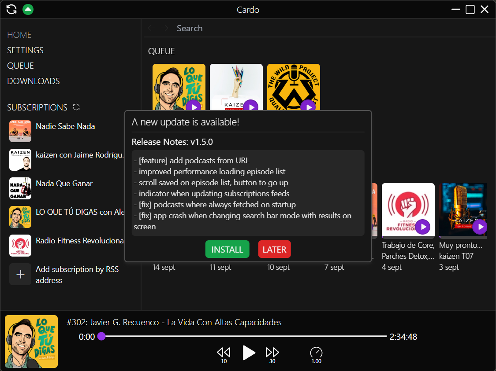

<h1 align="center">CARDO - PODCAST CLIENT</h1>

    

## Overview

Cardo is a podcast client for desktop, inspired on Android's [Antennapod](https://antennapod.org/). Cardo could be synchonized with Antennapod and other apps using [Nextcloud Gppoder](https://github.com/thrillfall/nextcloud-gpodder/) and [Gpodder/Opodsync](https://github.com/kd2org/opodsync).

### Features

- [x] Search podcasts online
- [x] Manage your subscriptions
- [x] Look at new episodes of your subscriptions with a glance
- [x] Synchronizing episodes state and subscriptions using Nexcloud Gpodder
- [x] Lightweight app (thanks to Tauri)
- [x] Customizable themes
- [x] Download episodes to listen them offline
- [x] Add podcast from feed url
- [x] Synchronization using [Opodsync](https://github.com/kd2org/opodsync)
- [ ] Keep your favorite episodes
- [ ] Audio manipulation, speed, silenze skip & normalization
- [ ] Add podcasts from sources other than i-tunes
- [ ] Windows taskbar play/pause button

### Compatible clients (from nextcloud-gpodder)

| client                                                                                                  | support status                                                                                                                                                                        |
| :------------------------------------------------------------------------------------------------------ | :------------------------------------------------------------------------------------------------------------------------------------------------------------------------------------ |
| [AntennaPod](https://antennapod.org)                                                                    | Initial purpose for this project, as a synchronization endpoint for this client.  Support is available [as of version 2.5.1](https://github.com/AntennaPod/AntennaPod/pull/5243/). |
| [KDE Kasts](https://apps.kde.org/de/kasts/)                                                             | Supported since version 21.12                                                                                                                                                         |
| [Podcast Merlin](https://github.com/yoyoooooooooo/Podcast-Merlin--Nextcloud-Gpodder-Client-For-Windows) | Full sync support podcast client for Windows                                                                                                                                          |
| [RePod](https://apps.nextcloud.com/apps/repod)                                                          | Nextcloud app for playing and managing podcasts with sync support                                                                                                                     |

## Contributing

### Helping with donations

If you like this app you can contribute buying me a cofee or whatever you want, that would be really great :)

    
    

### If you are a developer

It's also nice if you want to improve the app. The stack is Tauri v1 + React + Typescript + Tailwind.

To install dependencies `pnpm i` command should be enough. To setup a Tauri development environment check their [docs](https://tauri.app/v1/guides/getting-started/prerequisites), are pretty good.
In [tauri-conf.json](/src-tauri/tauri.conf.json) you should remove the updater configuration and windows certificate settings, or you will experiment errors of missing private key / certificate.

Be free of summiting a PR if you get something good!

### Translations

#### Current status

<!-- TRANSLATION-TABLE-START -->

<table>
  <thead>
    <tr>
      <th>Language</th>
      <th>Status</th>
    </tr>
  </thead>
  <tbody>
     <tr>
      <td>en</td>
      <td style="color: green;">100%</td>
    </tr>
     <tr>
      <td>es</td>
      <td style="color: green;">100%</td>
    </tr>
     <tr>
      <td>de</td>
      <td style="color: green;">95%</td>
    </tr>
     <tr>
      <td>cn</td>
      <td style="color: green;">95%</td>
    </tr>
     <tr>
      <td>pt</td>
      <td style="color: green;">94%</td>
    </tr>
  </tbody>
</table>

<!-- TRANSLATION-TABLE-END -->

#### Contributing

You can contribute with translations if you speak some other languages.
It's only needed to replicate json's files in [folder](resources/translations). There is a tool on scripts to auto translate it using Google Translate, but I didn't want to leave a bad translations, even english could be badly translated as it isn't my mother language.

## Troubleshooting

On windows you may experience a Windows shield alert, that's because app is signed with a self-signed certificate, not a paid one. Maybe alerts stop appearing if the app earns some reputation. Of course you don't have to believe me, inspecting the code and building it by yourself is always the safer option.
